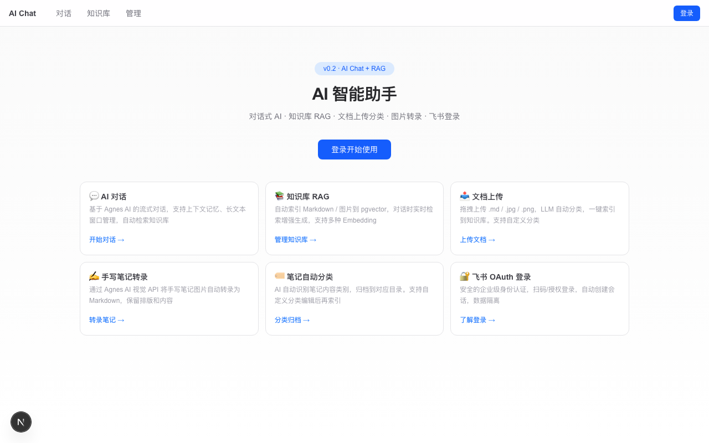
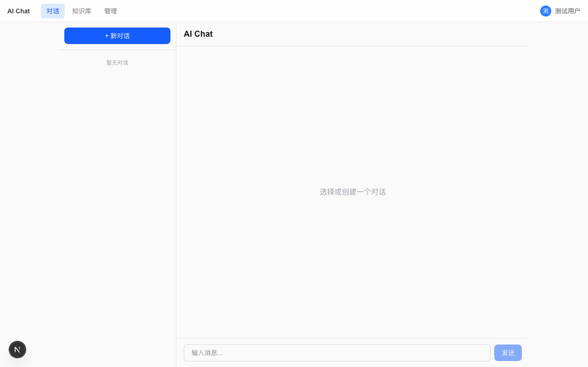
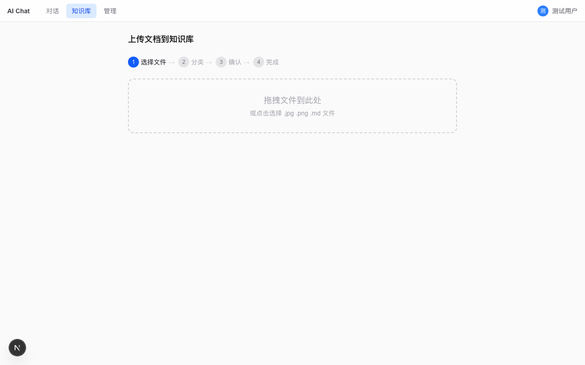
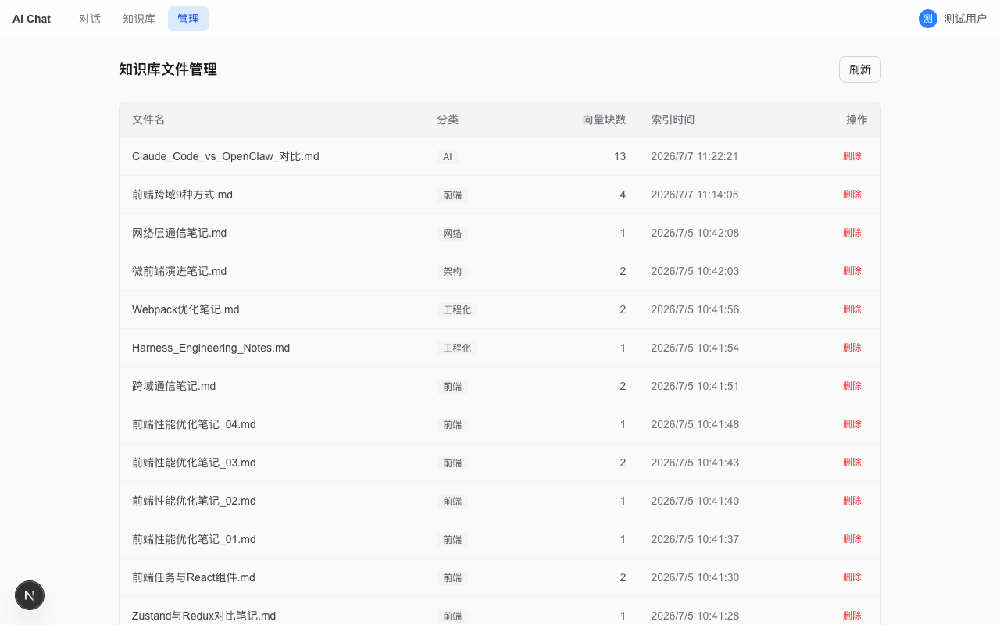
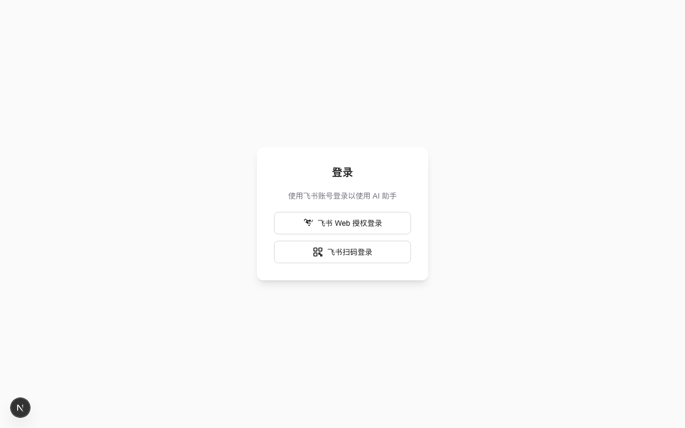

# AI 智能助手

AI 对话 + RAG 知识库 + 飞书 OAuth 认证。

## 页面截图

| 页面 | 截图 |
|------|------|
| **首页** — 功能卡片导航 |  |
| **AI 对话** — 流式 SSE，会话管理，Markdown 渲染 |  |
| **文档上传分类** — 拖拽上传 → LLM 分类 → 编辑 → RAG 索引 |  |
| **知识库管理** — 文件列表 + 删除（级联清理 DB+磁盘） |  |
| **飞书 OAuth 登录** — 扫码/授权登录 |  |

## 技术栈

| 层 | 技术 |
|---|---|
| **框架** | Next.js 16 (App Router) |
| **语言** | TypeScript |
| **样式** | Tailwind CSS 4 |
| **状态管理** | Zustand |
| **数据库** | PostgreSQL + Prisma 7 + pgvector |
| **LLM** | Agnes AI (OpenAI 兼容) / DeepSeek |
| **编排** | LangChain + LangGraph Agent |
| **Embedding** | Ollama (bge-m3, 1024d) |
| **流式** | 自定义 SSE Hook (RAF 节流) |
| **认证** | 飞书 OAuth v2.0 |
| **测试** | Vitest + Playwright |

## 已实现能力

- **AI 对话** — 流式 SSE 输出，保留上下文，支持 Markdown 渲染
- **知识库 RAG** — 文档自动分块 → Embedding → pgvector 检索增强生成
- **文档上传** — 拖拽上传 .md / .jpg / .png，LLM 自动分类，一键索引
- **手写笔记转录** — Agnes AI 视觉 API 将图片笔记转为 Markdown
- **笔记自动分类** — AI 识别内容类别，自动归档到子目录
- **文件管理** — 知识库文件列表查看 + 删除（级联清理向量和磁盘文件）
- **飞书 OAuth 登录** — 扫码/授权登录，Session 会话管理
- **对话历史** — 会话持久化，长上下文管理
- **上传→分类→RAG 工作流** — 从上传到索引的完整闭环

## 快速开始

```bash
npm install
npm run dev
```

访问 [http://localhost:3000](http://localhost:3000)。

> 需要 PostgreSQL + pgvector + Ollama (bge-m3) 环境，配置 `.env` 环境变量。
